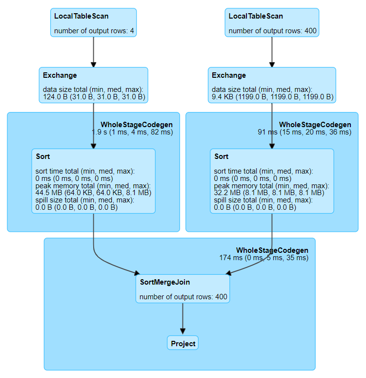
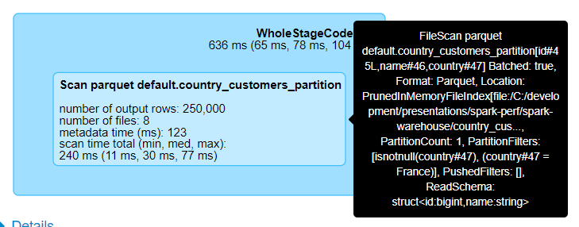
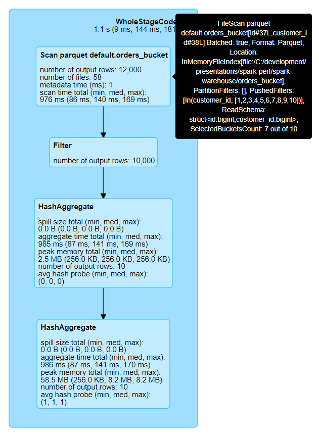
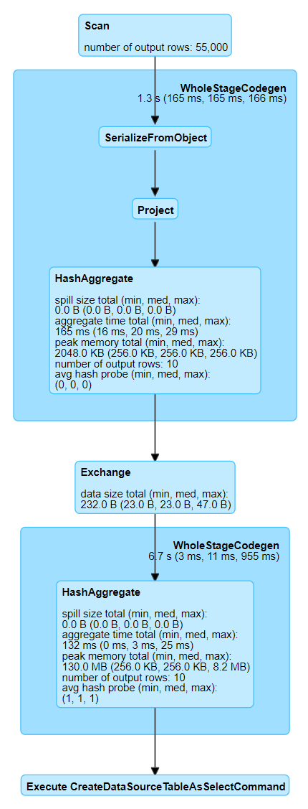
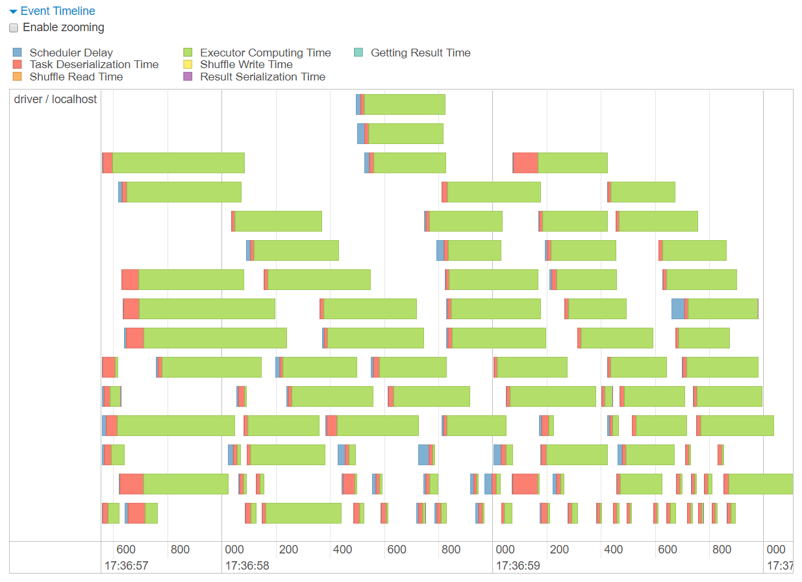

# Hints for Profiling with Spark UI

Hints will help you navigating and finding information in Spark UI.

**Warning icons** :warning: signal elements that are important to be aware of.

## Broadcast Hash Join

**Details for Query 0** (or 1 or 2)

* **LocalTableScan** \
  [`id`#2L, `name`#3]

* **LocalTableScan** \
  [`id`#7L, `customer_id`#8L]

* **BroadcastExchange** \
  _HashedRelationBroadcastMode_:warning:(List(input[0, bigint, false]))

* **BroadcastHashJoin**:warning: \
  [`id`#2L], [`customer_id`#8L], Inner, BuildLeft

* **Project** \
  [`id`#2L AS `customer_id`#24L, `name`#3, `id`#7L AS `order_id`#25L]

## Shuffled Hash Join

**Details for Query 0**

* **LocalTableScan** \
  [`id`#2L, `name`#3]

* **LocalTableScan** \
  [`id`#7L, `customer_id`#8L]

* **Exchange** \
  _hashpartitioning_:warning:(`id`#2L, 100)

* **Exchange** \
  _hashpartitioning_:warning:(`customer_id`#8L, 100)

* **ShuffledHashJoin**:warning: \
  [`id`#2L], [`customer_id`#8L], Inner, BuildLeft

* **Project** \
  [`id`#2L AS `customer_id`#24L, `name`#3, `id`#7L AS `order_id`#25L]

## Sort Merge Join

**Details for Query 0**

* **LocalTableScan** \
  [`id`#2L, `name`#3]

* **LocalTableScan** \
  [`id`#7L, `customer_id`#8L]

* **Exchange** \
  hashpartitioning(`id`#2L, 200)

* **Exchange** \
  hashpartitioning(`customer_id`#8L, 200)

* **Sort**:warning: \
  [`id`#2L ASC NULLS FIRST], false, 0

* **Sort**:warning: \
  [`customer_id`#8L ASC NULLS FIRST], false, 0

* **SortMergeJoin**:warning: \
  [`id`#2L], [`customer_id`#8L], Inner

* **Project** \
  [`id`#2L AS `customer_id`#24L, `name`#3, `id`#7L AS `order_id`#25L]

## Partitioning

### Without Partitioning

**Details for Query 1**

* **FileScan parquet** \
  `default.country_customers_no_partition` \
  [`id`#13L,`name`#14,`country`#15] \
  Batched: true, Format: Parquet, \
  Location: InMemoryFileIndex[file:/C:/development/presentations/spark-perf/spark-warehouse/country_customers..., \
  PartitionFilters: [], \
  PushedFilters: [IsNotNull(`country`), EqualTo(`country`,France)], \
  ReadSchema: struct<`id`:bigint,`name`:string,`country`:string>

* **Filter** \
  (isnotnull(`country`#15) && (`country`#15 = France))

* **Project** \
  [`id`#13L, `name`#14, `country`#15]

### With Partitioning

**Details for Query 3**

* **FileScan parquet** \
  default.country_customers_partition \
  [`id`#33L,`name`#34,`country`#35] \
  Batched: true, Format: Parquet, \
  Location: _PrunedInMemoryFileIndex_:warning:[file:/C:/development/presentations/spark-perf/spark-warehouse/country_cus..., \
  _PartitionCount: 1_:warning:, \
  _PartitionFilters: [isnotnull(`country`#35), (`country`#35 = France)]_:warning:, \
  PushedFilters: [], \
  ReadSchema: struct<`id`:bigint,`name`:string>

* :warning:

* :warning:

## Bucketing

### Without bucketing

**Details for Query 1**

* **FileScan parquet** \
  `default.orders_no_bucket` \
  [`id`#8L,`customer_id`#9L] \
  Batched: true, Format: Parquet, \
  Location: InMemoryFileIndex[file:/C:/development/presentations/spark-perf/spark-warehouse/orders_no_bucket], \
  PartitionFilters: [], \
  PushedFilters: [In(`customer_id`, [1,2,3,4,5,6,7,8,9,10])], \
  ReadSchema: struct<`id`:bigint,`customer_id`:bigint>

* **Filter** \
  `customer_id`#9L IN (1,2,3,4,5,6,7,8,9,10)

* **HashAggregate** \
  (keys=[`customer_id`#9L], \
  functions=[_partial_count_:warning:(`id`#8L)], \
  output=[`customer_id`#9L, `count`#19L])

* **Exchange**:warning: \
  hashpartitioning(`customer_id`#9L, 200)

* **HashAggregate** \
  (keys=[`customer_id`#9L], \
  functions=[_count_:warning:(`id`#8L)], \
  output=[`customer_id`#9L, `order_count`#15L])

### With Bucketing

**Details for Query 3**

* **FileScan parquet** \
  `default.orders_bucket` \
  [`id`#29L,`customer_id`#30L] \
  Batched: true, Format: Parquet, \
  Location: InMemoryFileIndex[file:/C:/development/presentations/spark-perf/spark-warehouse/orders_bucket], \
  PartitionFilters: [], \
  PushedFilters: [In(`customer_id`, [1,2,3,4,5,6,7,8,9,10])], \
  ReadSchema: struct<`id`:bigint,`customer_id`:bigint>, \
  _SelectedBucketsCount: 7 out of 10_:warning:

* **Filter** \
  `customer_id`#30L IN (1,2,3,4,5,6,7,8,9,10)

* **HashAggregate** \
  (keys=[`customer_id`#30L], \
  functions=[_partial_count_:warning:(`id`#29L)], \
  output=[`customer_id`#30L, `count`#40L])

* :warning:

* **HashAggregate** \
  (keys=[`customer_id`#30L], \
  functions=[_count_:warning:(`id`#29L)], \
  output=[`customer_id`#30L, `order_count`#36L])

## Coalescing and Repartitioning

### Neither coalescing nor repartitioning

**Details for Query 0**

* **Scan** \
  [obj#2]

* **Stage 0** \
  (8 tasks):warning: in **Details for Job 0**

  * **SerializeFromObject** \
    [assertnotnull(input[0, Order, true]).id AS `id`#3L, assertnotnull(input[0, Order, true]).customer_id AS `customer_id`#4L]

  * **Project** \
    [`customer_id`#4L]

  * **HashAggregate** \
    (keys=[`customer_id`#4L], \
    functions=[partial_count(1)], \
    output=[`customer_id`#4L, `count`#15L])

  * **Exchange** \
    hashpartitioning(`customer_id`#4L, 200)

* **Stage 1** \
  (200 tasks):warning: in **Details for Job 0**

  * **HashAggregate** \
    (keys=[`customer_id`#4L], \
    functions=[count(1)], \
    output=[`customer_id`#4L, `order_count`#9L])

  * **Execute CreateDataSourceTableAsSelectCommand** \
    `order_counts`, Overwrite, [`customer_id`, `order_count`]

**Details for Job 0**

### Coalescing

**Details for Query 1**

* **Scan** \
  [obj#18]

* **Stage 2** \
  (8 tasks):warning: in **Details for Job 1**

  * **SerializeFromObject** \
    [assertnotnull(input[0, Order, true]).id AS `id`#19L, assertnotnull(input[0, Order, true]).customer_id AS `customer_id`#20L]

  * **Project** \
    [`customer_id`#20L]

  * **HashAggregate** \
    (keys=[`customer_id`#20L],
    functions=[partial_count(1)],
    output=[`customer_id`#20L, `count`#31L])

  * **Exchange** \
    hashpartitioning(`customer_id`#20L, 200)

* **Stage 3** \
  (20 tasks):warning: in **Details for Job 1**

  * **HashAggregate** \
    (keys=[`customer_id`#20L], \
    functions=[count(1)], \
    output=[`customer_id`#20L, `order_count`#25L])

  * **Coalesce**:warning: \
    _20_:warning:

  * **Execute CreateDataSourceTableAsSelectCommand** \
    `order_counts_coalesce`, Overwrite, [`customer_id`, `order_count`]

**Details for Job 1**

### Repartitioning

**Details for Query 2**

* **Scan** \
  [obj#34]

* **Stage 4** \
  (8 tasks):warning: in **Details for Job 2**

  * **SerializeFromObject** \
    [assertnotnull(input[0, Order, true]).id AS `id`#35L, assertnotnull(input[0, Order, true]).customer_id AS `customer_id`#36L]

  * **Project** \
    [`customer_id`#36L]

  * **HashAggregate** \
    (keys=[`customer_id`#36L], \
    functions=[partial_count(1)], \
    output=[`customer_id`#36L, count#47L])

  * **Exchange** \
    hashpartitioning(`customer_id`#36L, 200)

* **Stage 5** \
  (200 tasks):warning: in **Details for Job 2**

  * **HashAggregate** \
    (keys=[`customer_id`#36L], \
    functions=[count(1)], \
    output=[`customer_id`#36L, `order_count`#41L])

  * **Exchange**:warning: \
    _RoundRobinPartitioning(20)_:warning:

* **Stage 6** \
  (20 tasks):warning: in **Details for Job 2**

  * **Execute CreateDataSourceTableAsSelectCommand** \
    `order_counts_repartition`, Overwrite, [`customer_id`, `order_count`]

**Details for Job 2**

## Join Skew

### Observing skew

**Details for Query 0**

* Click on Job **0** link

**Details for Job 0**

* Click on **Stage 2** (longest running stage) in **Event Timeline** after unfolding
* Or click on **Stage 2** (stage where join is performed) in **DAG Visualization**

**Details for Stage 2**

* **Event Timeline** diagram

  

* **Summary Metrics for 200 Completed Tasks** table

  

* **Tasks** table

### Fixing skew with salting

**Details for Query 1**

* Click on Job **1** link

**Details for Job 1**

* Click on **Stage 5** (longest running stage) in **Event Timeline** after unfolding
* Or click on **Stage 5** (stage where join is performed) in **DAG Visualization**

**Details for Stage 5**

* **Event Timeline** diagram

  

* **Summary Metrics for 200 Completed Tasks** table

  

* **Tasks** table
