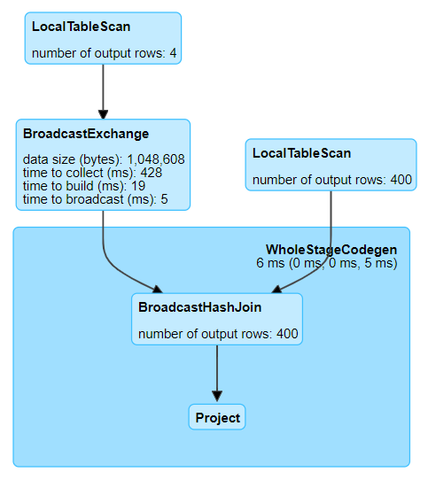

# Broadcast Hash Join

**Warning icons** :warning: signal elements that are important to be aware of.

**Details for Query 0** (or 1 or 2)

* **LocalTableScan** \
  [`id`#2L, `name`#3]

* **LocalTableScan** \
  [`id`#7L, `customer_id`#8L]

* **BroadcastExchange** \
  _HashedRelationBroadcastMode_:warning:(List(input[0, bigint, false]))

* **BroadcastHashJoin**:warning: \
  [`id`#2L], [`customer_id`#8L], Inner, BuildLeft

* **Project** \
  [`id`#2L AS `customer_id`#24L, `name`#3, `id`#7L AS `order_id`#25L]
