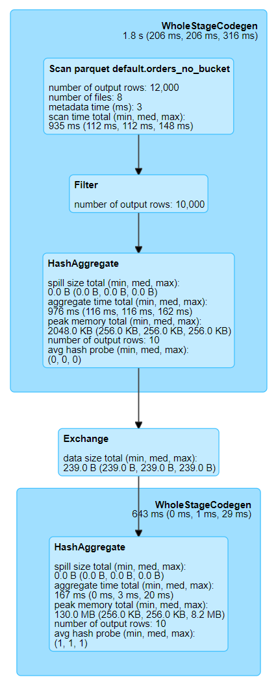
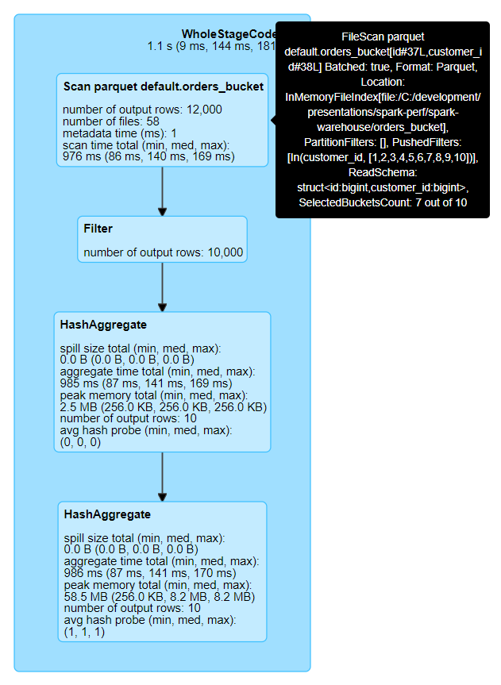

# Bucketing

**Warning icons** :warning: signal elements that are important to be aware of.

## Without bucketing

**Details for Query 1**

* **FileScan parquet** \
  `default.orders_no_bucket` \
  [`id`#8L,`customer_id`#9L] \
  Batched: true, Format: Parquet, \
  Location: InMemoryFileIndex[file:/C:/development/presentations/spark-perf/spark-warehouse/orders_no_bucket], \
  PartitionFilters: [], \
  PushedFilters: [In(`customer_id`, [1,2,3,4,5,6,7,8,9,10])], \
  ReadSchema: struct<`id`:bigint,`customer_id`:bigint>

* **Filter** \
  `customer_id`#9L IN (1,2,3,4,5,6,7,8,9,10)

* **HashAggregate** \
  (keys=[`customer_id`#9L], \
  functions=[_partial_count_:warning:(`id`#8L)], \
  output=[`customer_id`#9L, `count`#19L])

* **Exchange**:warning: \
  hashpartitioning(`customer_id`#9L, 200)

* **HashAggregate** \
  (keys=[`customer_id`#9L], \
  functions=[_count_:warning:(`id`#8L)], \
  output=[`customer_id`#9L, `order_count`#15L])

## With Bucketing

**Details for Query 3**

* **FileScan parquet** \
  `default.orders_bucket` \
  [`id`#29L,`customer_id`#30L] \
  Batched: true, Format: Parquet, \
  Location: InMemoryFileIndex[file:/C:/development/presentations/spark-perf/spark-warehouse/orders_bucket], \
  PartitionFilters: [], \
  PushedFilters: [In(`customer_id`, [1,2,3,4,5,6,7,8,9,10])], \
  ReadSchema: struct<`id`:bigint,`customer_id`:bigint>, \
  _SelectedBucketsCount: 7 out of 10_:warning:

* **Filter** \
  `customer_id`#30L IN (1,2,3,4,5,6,7,8,9,10)

* **HashAggregate** \
  (keys=[`customer_id`#30L], \
  functions=[_partial_count_:warning:(`id`#29L)], \
  output=[`customer_id`#30L, `count`#40L])

* :warning:

* **HashAggregate** \
  (keys=[`customer_id`#30L], \
  functions=[_count_:warning:(`id`#29L)], \
  output=[`customer_id`#30L, `order_count`#36L])
