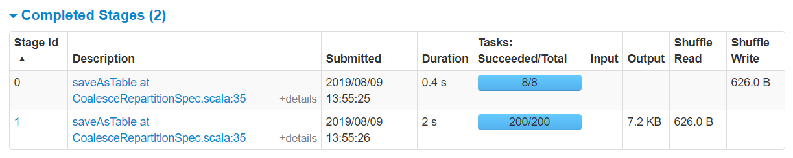

# Coalescing and Repartitioning

**Warning icons** :warning: signal elements that are important to be aware of.

## Neither coalescing nor repartitioning

**Details for Query 0**

* **Scan** \
  [obj#2]

* **Stage 0** \
  (8 tasks):warning: in **Details for Job 0**

  * **SerializeFromObject** \
    [assertnotnull(input[0, Order, true]).id AS `id`#3L, assertnotnull(input[0, Order, true]).customer_id AS `customer_id`#4L]

  * **Project** \
    [`customer_id`#4L]

  * **HashAggregate** \
    (keys=[`customer_id`#4L], \
    functions=[partial_count(1)], \
    output=[`customer_id`#4L, `count`#15L])

  * **Exchange** \
    hashpartitioning(`customer_id`#4L, 200)

* **Stage 1** \
  (200 tasks):warning: in **Details for Job 0**

  * **HashAggregate** \
    (keys=[`customer_id`#4L], \
    functions=[count(1)], \
    output=[`customer_id`#4L, `order_count`#9L])

  * **Execute CreateDataSourceTableAsSelectCommand** \
    `order_counts`, Overwrite, [`customer_id`, `order_count`]

**Details for Job 0**

## Coalescing

**Details for Query 1**

* **Scan** \
  [obj#18]

* **Stage 2** \
  (8 tasks):warning: in **Details for Job 1**

  * **SerializeFromObject** \
    [assertnotnull(input[0, Order, true]).id AS `id`#19L, assertnotnull(input[0, Order, true]).customer_id AS `customer_id`#20L]

  * **Project** \
    [`customer_id`#20L]

  * **HashAggregate** \
    (keys=[`customer_id`#20L],
    functions=[partial_count(1)],
    output=[`customer_id`#20L, `count`#31L])

  * **Exchange** \
    hashpartitioning(`customer_id`#20L, 200)

* **Stage 3** \
  (20 tasks):warning: in **Details for Job 1**

  * **HashAggregate** \
    (keys=[`customer_id`#20L], \
    functions=[count(1)], \
    output=[`customer_id`#20L, `order_count`#25L])

  * **Coalesce**:warning: \
    _20_:warning:

  * **Execute CreateDataSourceTableAsSelectCommand** \
    `order_counts_coalesce`, Overwrite, [`customer_id`, `order_count`]

**Details for Job 1**

## Repartitioning

**Details for Query 2**

* **Scan** \
  [obj#34]

* **Stage 4** \
  (8 tasks):warning: in **Details for Job 2**

  * **SerializeFromObject** \
    [assertnotnull(input[0, Order, true]).id AS `id`#35L, assertnotnull(input[0, Order, true]).customer_id AS `customer_id`#36L]

  * **Project** \
    [`customer_id`#36L]

  * **HashAggregate** \
    (keys=[`customer_id`#36L], \
    functions=[partial_count(1)], \
    output=[`customer_id`#36L, count#47L])

  * **Exchange** \
    hashpartitioning(`customer_id`#36L, 200)

* **Stage 5** \
  (200 tasks):warning: in **Details for Job 2**

  * **HashAggregate** \
    (keys=[`customer_id`#36L], \
    functions=[count(1)], \
    output=[`customer_id`#36L, `order_count`#41L])

  * **Exchange**:warning: \
    _RoundRobinPartitioning(20)_:warning:

* **Stage 6** \
  (20 tasks):warning: in **Details for Job 2**

  * **Execute CreateDataSourceTableAsSelectCommand** \
    `order_counts_repartition`, Overwrite, [`customer_id`, `order_count`]

**Details for Job 2**

