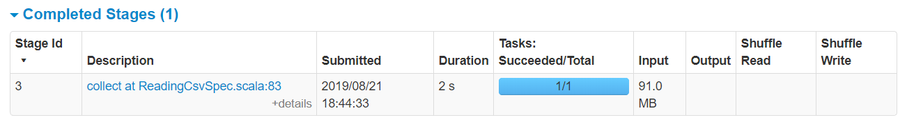
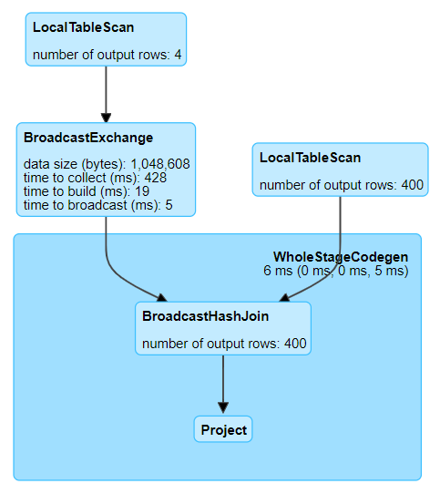
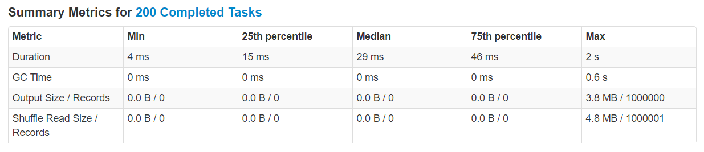

# Hints for Profiling with Spark UI

Hints will help you navigating and finding information in Spark UI.

**Warning icons** :warning: signal elements that are important to be aware of.

* [Partitioning](partitioning/hints.md)
* [Bucketing](bucketing/hints.md)
* [Coalescing and Repartitioning](coalescing-and-repartitioning/hints.md)
* [Reading CSV](#reading-csv)
* [Reading JSON](#reading-json)
* [Broadcast Hash Join](#broadcast-hash-join)
* [Shuffled Hash Join](#shuffled-hash-join)
* [Sort Merge Join](#sort-merge-join)
* [Join Skew](#join-skew)

## Reading CSV

### Non-Multiline CSV

**Spark Jobs**

**Details for Job 2**

### Multiline CSV

**Spark Jobs**

**Details for Job 3**

### Schema Inference

**Spark Jobs**

**Details for Stage 4** (of Job 4)

**Details for Stage 5** (of Job 5)

**Details for Stage 6** (of Job 6)

## Reading JSON

### JSON Lines File

### JSON File

### Schema Inference

## Broadcast Hash Join

**Details for Query 0** (or 1 or 2)

* **LocalTableScan** \
  [`id`#2L, `name`#3]

* **LocalTableScan** \
  [`id`#7L, `customer_id`#8L]

* **BroadcastExchange** \
  _HashedRelationBroadcastMode_:warning:(List(input[0, bigint, false]))

* **BroadcastHashJoin**:warning: \
  [`id`#2L], [`customer_id`#8L], Inner, BuildLeft

* **Project** \
  [`id`#2L AS `customer_id`#24L, `name`#3, `id`#7L AS `order_id`#25L]

## Shuffled Hash Join

**Details for Query 0**

* **LocalTableScan** \
  [`id`#2L, `name`#3]

* **LocalTableScan** \
  [`id`#7L, `customer_id`#8L]

* **Exchange** \
  _hashpartitioning_:warning:(`id`#2L, 100)

* **Exchange** \
  _hashpartitioning_:warning:(`customer_id`#8L, 100)

* **ShuffledHashJoin**:warning: \
  [`id`#2L], [`customer_id`#8L], Inner, BuildLeft

* **Project** \
  [`id`#2L AS `customer_id`#24L, `name`#3, `id`#7L AS `order_id`#25L]

## Sort Merge Join

**Details for Query 0**

* **LocalTableScan** \
  [`id`#2L, `name`#3]

* **LocalTableScan** \
  [`id`#7L, `customer_id`#8L]

* **Exchange** \
  hashpartitioning(`id`#2L, 200)

* **Exchange** \
  hashpartitioning(`customer_id`#8L, 200)

* **Sort**:warning: \
  [`id`#2L ASC NULLS FIRST], false, 0

* **Sort**:warning: \
  [`customer_id`#8L ASC NULLS FIRST], false, 0

* **SortMergeJoin**:warning: \
  [`id`#2L], [`customer_id`#8L], Inner

* **Project** \
  [`id`#2L AS `customer_id`#24L, `name`#3, `id`#7L AS `order_id`#25L]

## Join Skew

### Observing skew

**Details for Query 0**

* Click on Job **0** link

**Details for Job 0**

* Click on **Stage 2** (longest running stage) in **Event Timeline** after unfolding
* Or click on **Stage 2** (stage where join is performed) in **DAG Visualization**

**Details for Stage 2**

* **Event Timeline** diagram

  

* **Summary Metrics for 200 Completed Tasks** table

  

* **Tasks** table

### Fixing skew with salting

**Details for Query 1**

* Click on Job **1** link

**Details for Job 1**

* Click on **Stage 5** (longest running stage) in **Event Timeline** after unfolding
* Or click on **Stage 5** (stage where join is performed) in **DAG Visualization**

**Details for Stage 5**

* **Event Timeline** diagram

  

* **Summary Metrics for 200 Completed Tasks** table

  

* **Tasks** table
