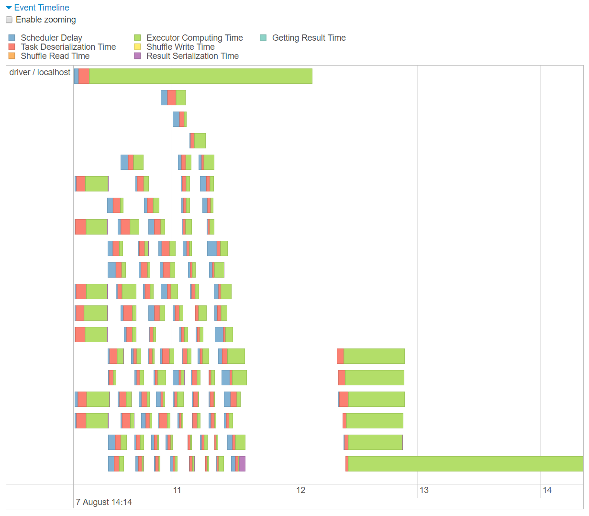
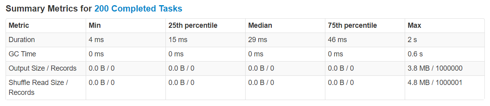
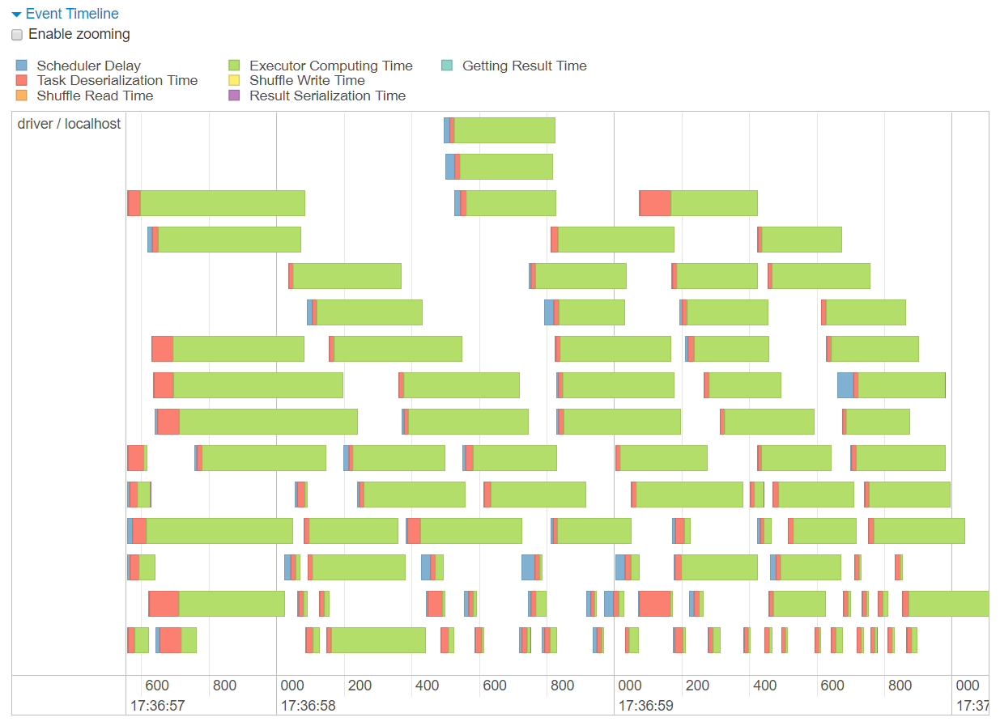
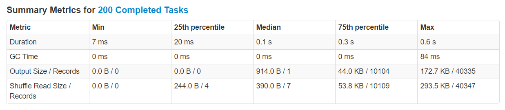

# Join Skew

**Warning icons** :warning: signal elements that are important to be aware of.

## Observing skew

**Details for Query 0**

* Click on Job **0** link

**Details for Job 0**

* Click on **Stage 2** (longest running stage) in **Event Timeline** after unfolding
* Or click on **Stage 2** (stage where join is performed) in **DAG Visualization**

**Details for Stage 2**

* **Event Timeline** diagram

  

* **Summary Metrics for 200 Completed Tasks** table

  

* **Tasks** table

## Fixing skew with salting

**Details for Query 1**

* Click on Job **1** link

**Details for Job 1**

* Click on **Stage 5** (longest running stage) in **Event Timeline** after unfolding
* Or click on **Stage 5** (stage where join is performed) in **DAG Visualization**

**Details for Stage 5**

* **Event Timeline** diagram

  

* **Summary Metrics for 200 Completed Tasks** table

  

* **Tasks** table
