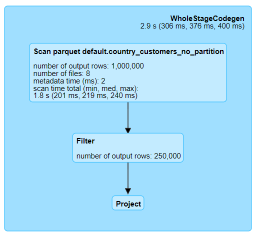
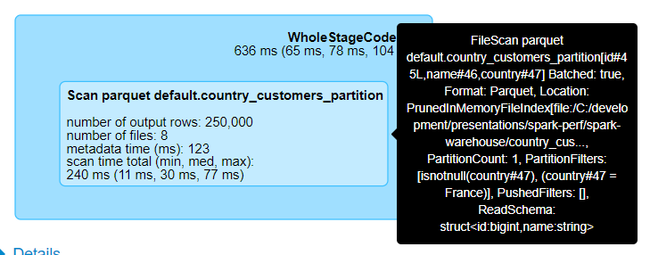

# Partitioning

**Warning icons** :warning: signal elements that are important to be aware of.

## Without Partitioning

**Details for Query 1**

* **FileScan parquet** \
  `default.country_customers_no_partition` \
  [`id`#13L,`name`#14,`country`#15] \
  Batched: true, Format: Parquet, \
  Location: InMemoryFileIndex[file:/C:/development/presentations/spark-perf/spark-warehouse/country_customers..., \
  PartitionFilters: [], \
  PushedFilters: [IsNotNull(`country`), EqualTo(`country`,France)], \
  ReadSchema: struct<`id`:bigint,`name`:string,`country`:string>

* **Filter** \
  (isnotnull(`country`#15) && (`country`#15 = France))

* **Project** \
  [`id`#13L, `name`#14, `country`#15]

## With Partitioning

**Details for Query 3**

* **FileScan parquet** \
  default.country_customers_partition \
  [`id`#33L,`name`#34,`country`#35] \
  Batched: true, Format: Parquet, \
  Location: _PrunedInMemoryFileIndex_:warning:[file:/C:/development/presentations/spark-perf/spark-warehouse/country_cus..., \
  _PartitionCount: 1_:warning:, \
  _PartitionFilters: [isnotnull(`country`#35), (`country`#35 = France)]_:warning:, \
  PushedFilters: [], \
  ReadSchema: struct<`id`:bigint,`name`:string>

* :warning:

* :warning:
