# Reading CSV

**Warning icons** :warning: signal elements that are important to be aware of.

**SQL**

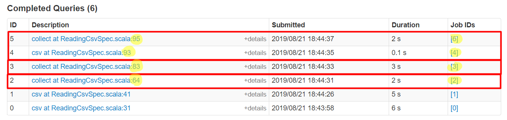

**Spark Jobs**

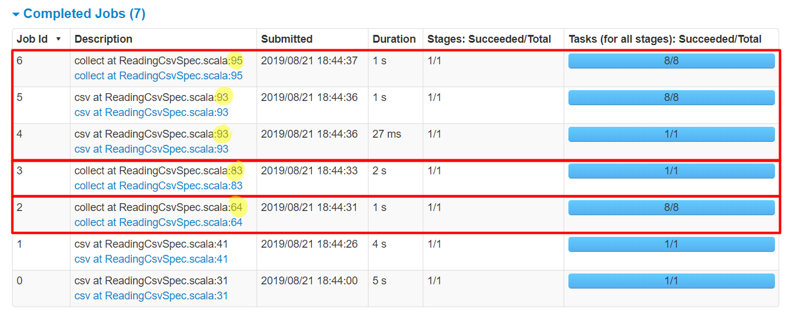

**Stages for All Jobs**

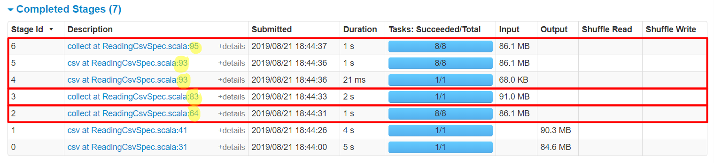

## Non-Multiline CSV

**Details for Query 2**

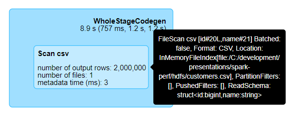

Query 2 - Job 2 \
**Details for Job 2**

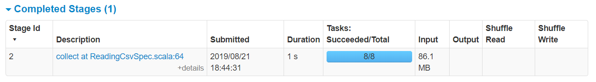

## Multiline CSV

**Details for Query 3**

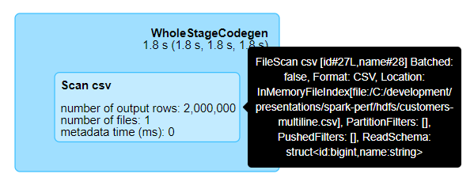

Query 3 - Job 3 \
**Details for Job 3**

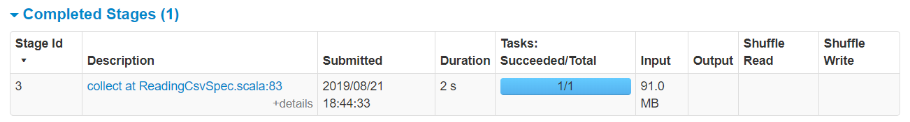

## Schema Inference

**Details for Query 4**

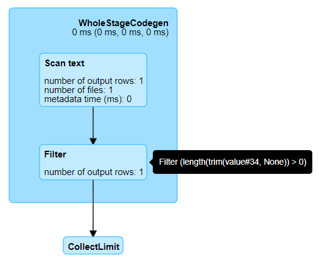

Query 4 - Job 4 - Stage 4 \
**Details for Stage 4**

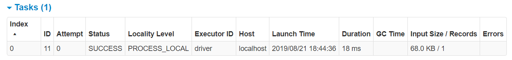

No Query - Job 5 - Stage 5 \
**Details for Stage 5**

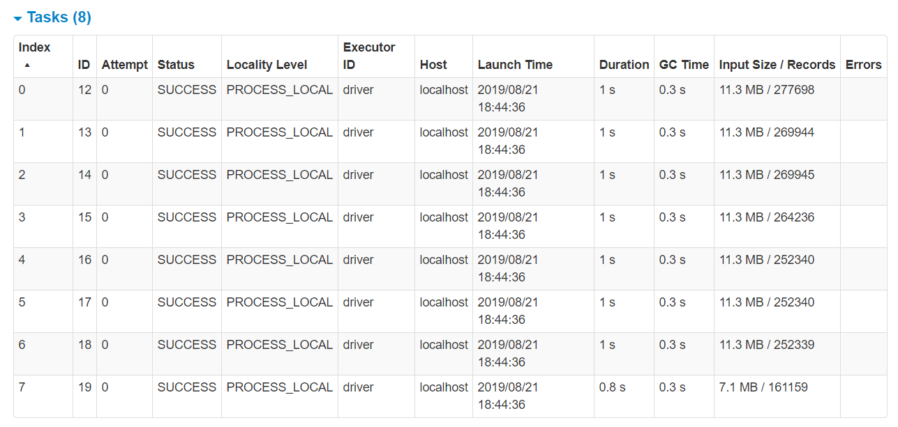

**Details for Query 5**

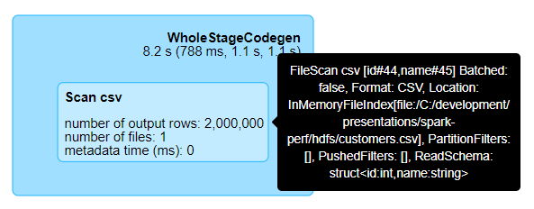

Query 5 - Job 6 - Stage 6 \
**Details for Stage 6**

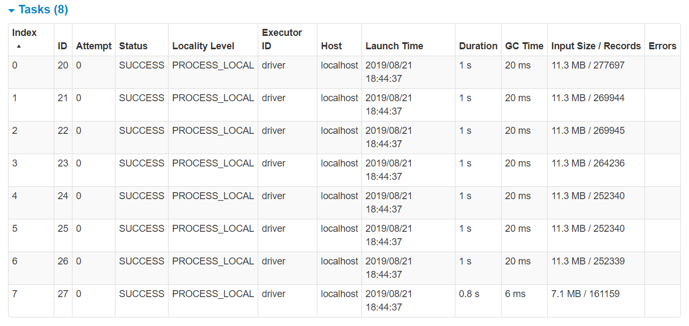
