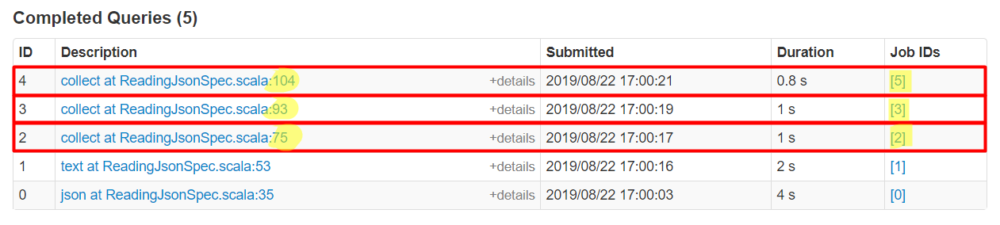
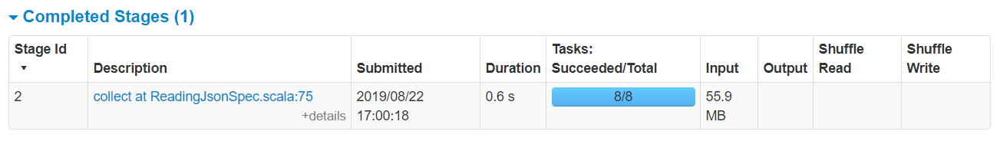
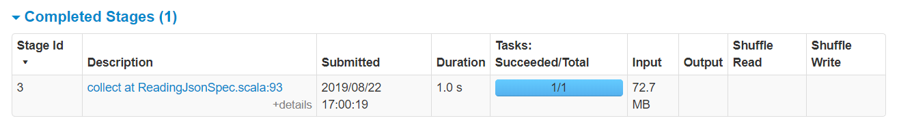

# Reading JSON

**Warning icons** :warning: signal elements that are important to be aware of.

**SQL**

**Spark Jobs**

**Stages for All Jobs**

## JSON Lines File

**Details for Query 2**

Query 2 - Job 2 \
**Details for Jon 2**

## JSON File

**Details for Query 3**

Query 3 - Job 3 \
**Details for Job 3**

## Schema Inference

No Query - Job 4 - Stage 4

**Details for Query 4**

Query 4 - Job 5 - Stage 5 \
**Details for Stage 5**

