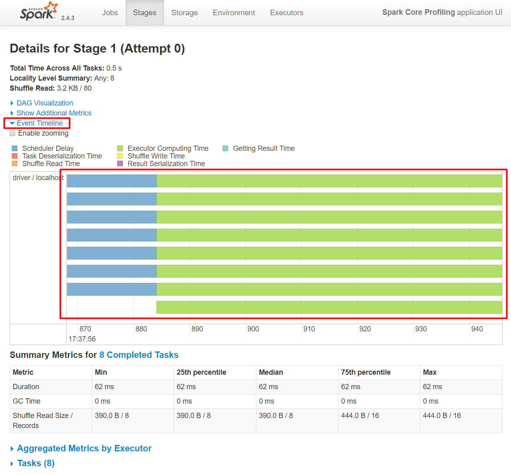

# A Tour of Spark UI

## Spark Core Profiling

* Go to `SparkCoreProfilingSpec` class
* Run the test class using **IntelliJ**,
  eventually it will block after all tests have been run,
  keeping Spark UI alive.
* Open **Spark UI** in a browser [http://localhost:4040](). \
  If another test is already running, Spark UI will bind to port 4041 and so on. \
  So be sure to stop the test after this part. :warning:

### Spark Jobs

**Spark Jobs** page displays.

Page shows a list of **jobs** launched by the application.

* **Jobs** are triggered by the **driver program** (or application) using a **spark session**.
* Only **actions** (as opposed to **transformations**) trigger **jobs**.
 
In this case spark session has app name _Spark Core Profiling_
(hence the name displayed in Spark UI).

Now

* View the timeline of jobs by unfolding **Event Timeline**.
  It will show **job** executions on a timeline.

  

* Navigate to the **Details for Job** page by either clicking:
  * a job link in the **Completed Jobs** table,
  * or a job in the **Event Timeline**

### Details for Job

**Details for Job** page displays (here job 0).

Page shows a **DAG Visualization** (directed acyclic graph) for the **job**.
* A **job** is executed over **stages**, some stages may run simultaneously.
* A **stage** execution results into the execution of multiples **tasks** each operating on a **partition** of the data.
* **Stages** are connected by arrows indicating a **shuffling** of data over the cluster.

Page also shows **Completed Stages** table, a list of stages for the job.
It shows most notably for each stage:

* Duration
* Number of **tasks** per stage
* **Shuffle** read and write per stage

Now

* View the timeline of job by unfolding **Event Timeline**.
  It will show **stage** executions on a timeline.

  

* Navigate to the **Details for Stage** page by either clicking:
  * on a stage link in the **Completed Stages** table,
  * or a stage in the **Event Timeline**

## Details for Stage

**Details for Stage** page displays (here stage 1).

Page shows a **DAG Visualization** of the stage.

Page also shows a **Summary Metrics for Completed Tasks** table.
This were you can identify high shuffling or uneven distribution problems.

Finally, page also shows **Tasks** table, a list of all tasks for the stage.
It shows most notably for each task:

* Duration
* Various read / write expressed in size and records (here **Shuffle Read Size / Records**)

Now

* View the timeline of stage by unfolding **Event Timeline**.
  It will show **task** executions on a timeline.

  

## Spark SQL Profiling

* Stop `SparkCoreProfilingSpec` execution 
* Go to `SparkSqlProfilingSpec` class
* Run the test class using **IntelliJ**,
  eventually it will block after all tests have been run,
  keeping Spark UI alive.
* Open **Spark UI** in a browser [http://localhost:4040](). \
  If another test is already running, Spark UI will bind to port 4041 and so on. \
  So be sure to stop the test after this part. :warning:
* Click **SQL** tab

### SQL

**SQL** page displays.

Page shows a list of Spark SQL **queries** launched by the application.

* **Queries** are triggered by the **driver program** (or application) using a **spark session**.
* Only **actions** applied to **dataset** or **dataframe** will trigger a **query**.
* A **query** is analyzed by the _**Catalyst**_ optimizer to eventually produce a **physical execution plan**.
* **Physical execution plan** will be executed on **Spark Core** using **RDD**s optimized with _**Tungsten**_.
* A **query** execution will result into **job** executions (1 or more jobs).

_**Catalyst**_ is a query optimizer that analyzes a query to produce a **physical plan**.

_**Tungsten**_ is a highly efficient way of representing records in (off-heap) memory.

* It can handle records with much better memory use and CPU efficiency.
* It also can generate JVM _bytecode_ for an entire stage,
  thus not incurring the performance cost of a traditional interpreter.

Now

* Navigate to the **Details for Query** page by clicking a query link in the **Completed Queries** table

### Details for Query

**Details for Query** page displays (here query 0).

Page shows **Succeeded Jobs** links to jobs which were launched the execute the query.

Also page prominently shows a visual representation of the physical plan made up by _**Catalyst**_.
Notice:

* `Exchange` node corresponding to **shuffling**
* `WholeStageCodegen` boxes corresponding to entire stages generated by _**Tungsten**_ under the form of JVM bytecode

Now

* Navigate to already known **Details for Job 0** page by clicking one of the job links

### Details for Job

**Details for Job** page displays (here job 0).

Back in Spark Core where Spark SQL queries are eventually executed, notice:

* 2 stages, each containing a `WholeStageCodegen` box generated by _**Tungsten**_
* a **shuffling** arrow between the 2 stages matching the `Exchange` node

Now you can utilize your knowledge of this part of Spark UI
to better understand how **queries** are executed as **jobs** over **stages** and **tasks**.
